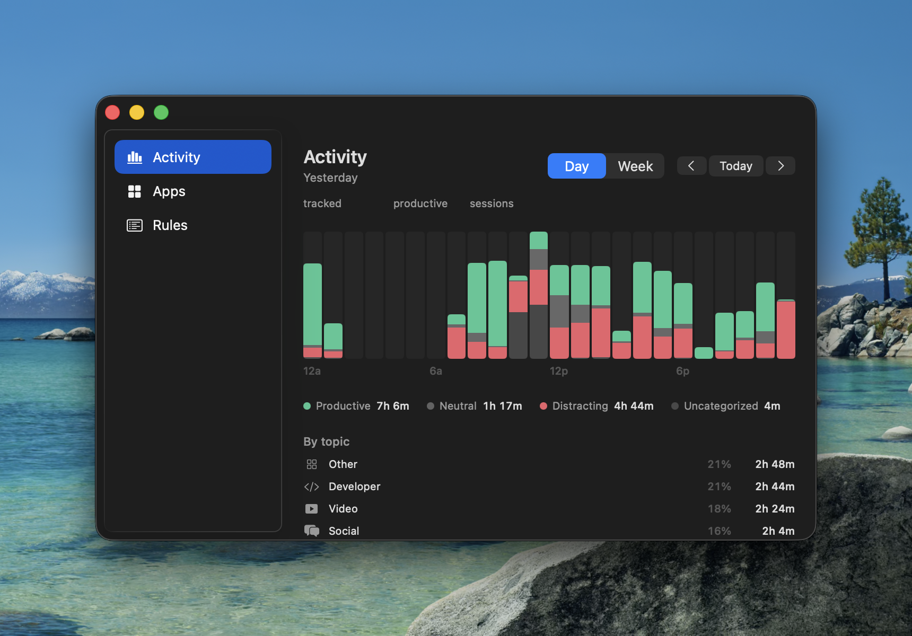
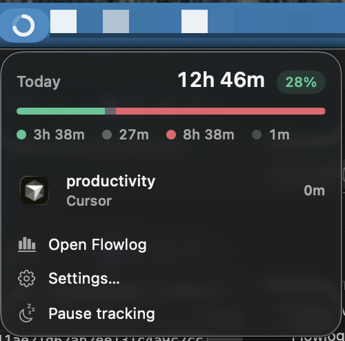

# Flowlog

Native macOS menu bar app for tracking time, focus, and productivity.



Flowlog runs quietly in the background, logging which apps and sites you use, how long you spend in each, and whether that time was productive, neutral, or distracting. Open the dashboard for a day or week view, browse per-app breakdowns, and teach the classifier with rules when it gets something wrong.



## Features

- **Automatic tracking** — logs app switches, window titles, and browser sites as sessions
- **Focus score** — productive vs. neutral vs. distracting breakdown with a daily focus percentage
- **Activity timeline** — day and week views with category-colored blocks, topics, and session detail
- **Smart classification** — user rules, known app/site catalogs, and optional on-device or OpenRouter AI
- **Menu bar companion** — today's totals, current session, pause tracking, quick access to the dashboard
- **Nudges and summaries** — optional notifications when you're off track, plus daily and weekly recaps
- **CLI** — `flowlog` command for summaries, health checks, and SQL queries against your local database
- **Auto-updates** — Sparkle checks GitHub Releases for new builds

Data stays on your Mac in `~/Library/Application Support/Flowlog/`.

## Requirements

- macOS 26+
- Accessibility permission (window titles)
- Screen Recording permission (optional screenshots for AI classification)

## Install

Download the latest notarized build from [GitHub Releases](https://github.com/mergd/flowlog/releases), unzip, and drag **Flowlog.app** into Applications.

Or build from source:

```bash
git clone https://github.com/mergd/flowlog.git
cd flowlog
open Productivity.xcodeproj
```

Run the **Productivity** scheme in Xcode, or ship a release build:

```bash
NOTARIZE=1 scripts/release
```

First-time Sparkle setup (signing keys for update feeds):

```bash
scripts/sparkle-setup
```

## CLI

Install the bundled `flowlog` command from **Settings → Command line tool**, then:

```bash
flowlog summary      # today's totals by category
flowlog apps         # per-app and per-site breakdown
flowlog health       # data quality diagnostics
flowlog recent 20    # latest sessions
```

## Project layout

| Path | Purpose |
|------|---------|
| `Productivity/App/` | Entry, windows, menu bar, app state |
| `Productivity/Views/` | SwiftUI dashboard and settings |
| `Productivity/Tracking/` | Workspace monitor, sessions, screenshots |
| `Productivity/Classification/` | Rules engine and AI classifiers |
| `Productivity/Storage/` | GRDB database and screenshot store |
| `scripts/release` | Archive, notarize, and publish updates |
| `scripts/flowlog` | CLI bundled into the app |

## License

Private / all rights reserved unless otherwise noted.
